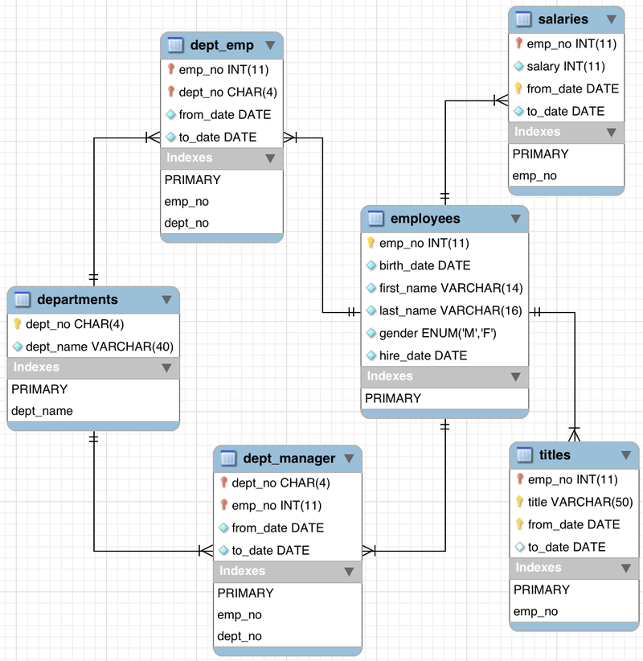

# 💊 MySQL Basics

_MySQL, SQL language, setting environment variables._

## 📔 Description
<p>
  
</p>

Intro pill which served as our first contact with the DBMS "MySQL", where we set an environment variable to be able to run the program from the command line, imported an example database from a ".sql" file provided by the official MySQL team, and executed some queries to play around with a DB and to getting familiar with the SQL language.

### 📂 Content

This repository contains the following files:

- **_README.md_**: this explanatory file.
- **_employees.sql_**: file containing an example database provided by the official MySQL team, to import and use in our exercise.
- **_queries.sql_**: file where we recorded all the necessary queries executed to fulfill this exercise.
- **_pill_**: in this folder there are many files that were used to develop the pill. There are 4 files, *insert.sql*, *update.sql*, *update.sql* and *delete sql*. Each file, have the question as a comment, and the solution in ``mysql``, for example:

```sql
-- Select all employees with a salary greater than 20,000
SELECT E.emp_no, E.first_name, E.last_name, S.salary 
FROM employees E
JOIN salaries S
ON S.emp_no = E.emp_no 
WHERE S.salary >= 20000;
```


