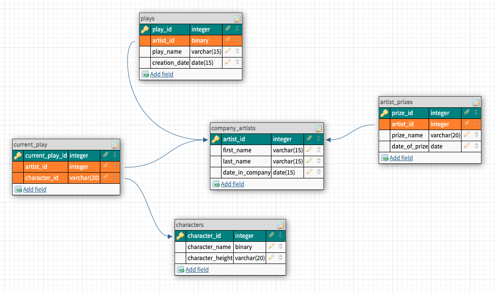

# 💊 MySQL Basics

_MySQL, SQL language, setting environment variables._

## 📔 Description

Intro pill which served as our first contact with the DBMS "MySQL", where we set an environment variable to be able to run the program from the command line, imported an example database from a ".sql" file provided by the official MySQL team, and executed some queries to play around with a DB and to getting familiar with the SQL language.

### 📂 Content

This repository contains only the following files:

- **_README.md_**: this explanatory file.
- **_employees.sql_**: file containing an example database provided by the official MySQL team, to import and use in our exercise.
- **_queries.sql_**: file where we recorded all the necessary queries executed to fulfill this exercise.
- **_backup.sql_**: file with the backup from the employees database as an example of backup.

### IMAGES FROM THE DATABASE CREATED



Design with dbdesigner (https://app.dbdesigner.net/).

### THINGS TO HAVE IN MIND

To be able to succesfully finalize this project make sure you have a database management system (DMS) based in SQL such as MySQL. For those of you who already have XAMPP in your computer you don't need to download anything else for it already comes with a DMS. In my case it came with MariaDB Server. This is one of the most popular open source relational databases. It’s made by the original developers of MySQL so full compatibility.
Only, make sure to look for the right syntax only when writing code according to the DMS version you have.

To check whereas you have it already install run this in your terminal (the syntax may vary depending, make sure you find it online it a syntax error occurs):

```
../bin/mysql --version
```

This will return the version of the DMS you have. It it returns nothing or an error you will have to download a DMS.

Next we enter the DMS with this code:

```
../bin/mysql -u root -p
```

Now we are inside and need to create a username for we have entered as the root user with all the permissions. We want to make sure we don't touch anything we don't want to. For that:

```
CREATE USER username@localhost IDENTIFIED BY 'password';
```

In username change to your likely username and in password select your own.
Next we need to grant privileges on that very own user we created with:

```
GRANT ALL PRIVILEGES ON * . * TO username@localhost;
```

Although in my version I needed to use:

```
GRANT USAGE ON *.* TO 'username'@'localhost' IDENTIFIED BY 'password';
```

If we exit the DMS with:

```
exit;
```

and try now with:

```
../bin/mysql -u username -p
```

we should be able to enter the password now, press enter and voilà, we shoul enter our user.

Next you need to download a tool to help you out with the visualization of the database and its tables. I used phpMyAdmin.
It is a free software tool written in PHP, intended to handle the administration of MySQL over the Web. There are other softwares such as workbench but it doesn't work that well in mac.

And then, work in the database.

Pro-tip: if you would like to create a back up of your database you can run this command in the terminal:

```
../bin/mysqldump -u username -pPassword databaseName > /path/path/path/fileName.sql;
```

And a sql file will be created with the code necessary to instaurate your database in case needed.
