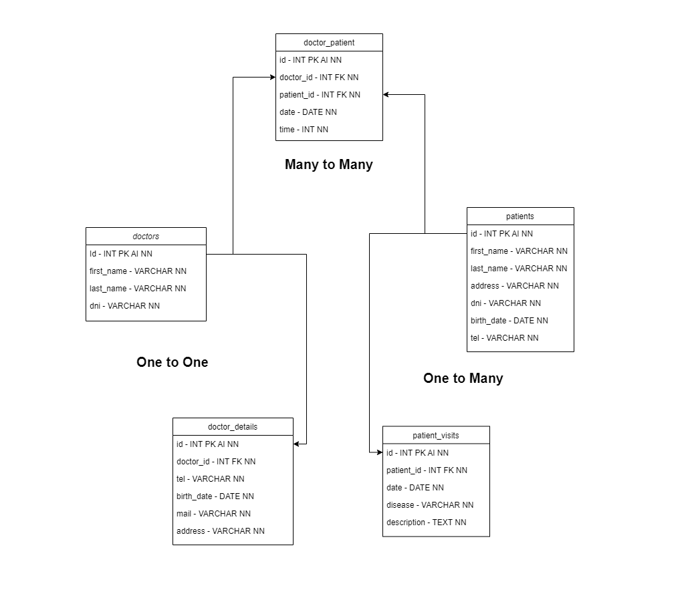

# 💊 MySQL Basics

_MySQL, SQL language

## 📔 Description

Intro pill which served as my first contact with the DBMS "MySQL", where we set an environment variable to be able to run the program from the command line, imported an example database from a ".sql" file provided by the official MySQL team, and executed some queries to play around with a DB and to getting familiar with the SQL language.

### 📂 Content

This repository contains only the following files:

- **_README.md_**: this explanatory file.
- **_diagram.png_**: file containing the diagram of the database.
- **_employees.sql_**: file containing an example database provided by the official MySQL team, to import and use in our exercise.
- **_queries.sql_**: file where I recorded all the necessary queries executed to fulfill this exercise.
